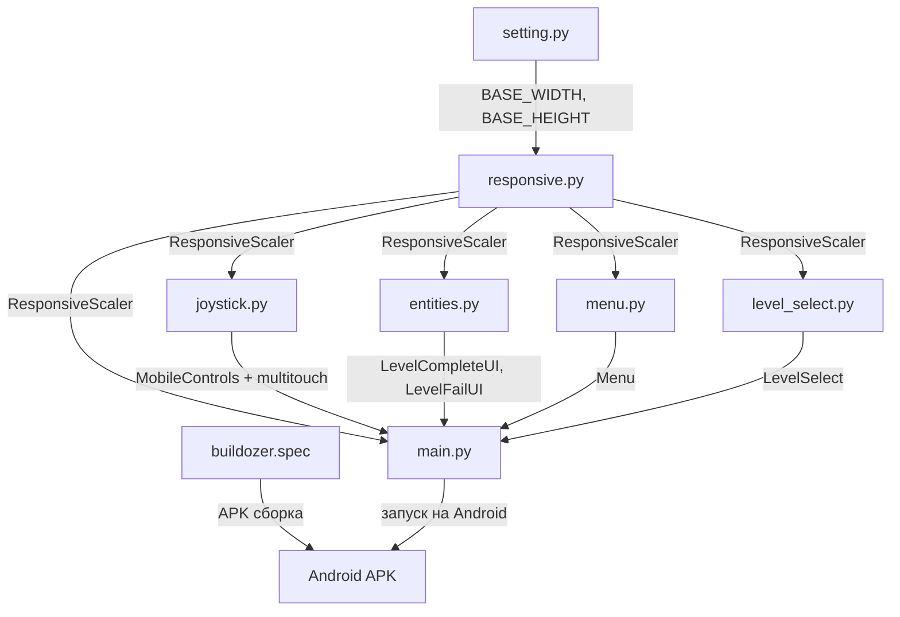

# План мобильной адаптации игры "Escape to EMK"

## Обзор

Проект уже имеет базовую мобильную поддержку: виртуальные джойстики (`joystick.py`), определение мобильного устройства (`setting.py`), интеграция в `main.py`. Однако есть три ключевых улучшения:

1. **Адаптивный UI** — динамическое масштабирование под любой экран
2. **Мультитач** — одновременное управление двумя джойстиками
3. **Сборка APK** — запуск на Android-устройствах

---

## Этап 1: Адаптивный UI (Responsive)

### Текущая проблема
- Размеры жёстко заданы: 800x480 для мобильных, 1280x720 для десктопа
- Джойстики, кнопки, UI-элементы имеют фиксированные размеры и позиции
- На разных экранах элементы могут быть слишком маленькими или большими

### План изменений

#### 1.1. Создать модуль `responsive.py`

Новый файл с классами для адаптивного масштабирования:

```python
class ResponsiveScaler:
    """
    Масштабирует все игровые элементы относительно базового разрешения.
    Базовое разрешение: 1280x720 (десктоп) или 800x480 (мобильное)
    """
    - base_width, base_height: базовое разрешение
    - current_width, current_height: фактическое разрешение экрана
    - scale_x, scale_y: коэффициенты масштабирования
    - scale: единый коэффициент (минимальный из scale_x, scale_y)
    
    Methods:
    - scale_value(value): масштабирует число
    - scale_rect(rect): масштабирует прямоугольник
    - scale_font(size): масштабирует размер шрифта
    - get_centered_position(obj_width, obj_height): центрирует объект
```

#### 1.2. Модифицировать `setting.py`

- Убрать жёсткую привязку `SCREEN_WIDTH`/`SCREEN_HEIGHT` к `IS_MOBILE`
- Сделать определение реального разрешения экрана динамическим
- Добавить конфигурацию `BASE_WIDTH`/`BASE_HEIGHT` для каждого режима
- Все размеры (персонажи, скорости) вычислять относительно базового разрешения

```python
# Новый подход
if IS_MOBILE:
    BASE_WIDTH, BASE_HEIGHT = 800, 480
else:
    BASE_WIDTH, BASE_HEIGHT = 1280, 720

# Реальное разрешение определяется при создании окна
SCREEN_WIDTH = info.current_w
SCREEN_HEIGHT = info.current_h
```

#### 1.3. Модифицировать `joystick.py`

- Использовать `ResponsiveScaler` для расчёта размеров и позиций джойстиков
- Размеры джойстиков, кнопок, отступов вычислять относительно текущего разрешения
- Шрифты подписей масштабировать динамически

```python
class MobileControls:
    def __init__(self, screen_width, screen_height):
        self.scaler = ResponsiveScaler(screen_width, screen_height, 
                                        BASE_WIDTH, BASE_HEIGHT)
        # Размеры теперь вычисляются
        joystick_radius = self.scaler.scale_value(80)
        margin = self.scaler.scale_value(100)
```

#### 1.4. Модифицировать `entities.py` (UI классы)

- `LevelCompleteUI` и `LevelFailUI` — размеры кнопок, шрифтов, отступов вычислять через `ResponsiveScaler`
- Позиции кнопок центрировать относительно текущего разрешения

#### 1.5. Модифицировать `menu.py` и `level_select.py`

- Фоновые изображения масштабировать под текущее разрешение
- Кнопки и их размеры вычислять динамически
- Шрифты подписей масштабировать

#### 1.6. Модифицировать `main.py`

- При создании окна определять реальное разрешение
- Передавать `ResponsiveScaler` во все UI-компоненты
- Фон масштабировать под текущее разрешение

---

## Этап 2: Полноценная поддержка мультитач

### Текущая проблема
- В `joystick.py` обработка `FINGERDOWN`/`FINGERMOTION`/`FINGERUP` есть, но:
  - Нет одновременной обработки двух касаний (мультитач)
  - Кнопки и джойстики конкурируют за одно касание
  - Нет приоритизации касаний

### План изменений

#### 2.1. Модифицировать `VirtualJoystick` в `joystick.py`

- Улучшить систему `touch_id`: каждое касание привязывается к конкретному элементу управления
- Добавить метод `is_touch_claimed(touch_id)` — проверка, занято ли касание
- Добавить метод `release_touch(touch_id)` — освобождение касания

```python
class VirtualJoystick:
    def __init__(self, ...):
        self.touch_id = None  # ID текущего касания
        self.touch_history = []  # история касаний для отладки
    
    def claim_touch(self, touch_id):
        """Захватывает касание, если джойстик свободен"""
        if self.touch_id is None:
            self.touch_id = touch_id
            return True
        return False
    
    def release_touch(self, touch_id):
        """Освобождает касание"""
        if self.touch_id == touch_id:
            self.touch_id = None
            self.reset()
```

#### 2.2. Модифицировать `MobileControls` в `joystick.py`

- Полностью переработать `handle_events()` для поддержки мультитач
- Каждое событие `FINGERDOWN` проверять все элементы управления
- Приоритет: джойстики > кнопки
- Обрабатывать события в порядке: `FINGERDOWN` → `FINGERMOTION` → `FINGERUP`

```python
def handle_events(self, events):
    for event in events:
        if event.type == pygame.FINGERDOWN:
            # Проверяем джойстики (приоритет)
            if self.joystick1.claim_touch(event.finger_id):
                self.joystick1.handle_event(event)
            elif self.joystick2.claim_touch(event.finger_id):
                self.joystick2.handle_event(event)
            elif self.check_button_touch(event):
                # Обработка кнопок
                pass
        elif event.type == pygame.FINGERMOTION:
            # Направляем событие соответствующему джойстику
            if event.finger_id == self.joystick1.touch_id:
                self.joystick1.handle_event(event)
            elif event.finger_id == self.joystick2.touch_id:
                self.joystick2.handle_event(event)
        elif event.type == pygame.FINGERUP:
            # Освобождаем касание
            self.joystick1.release_touch(event.finger_id)
            self.joystick2.release_touch(event.finger_id)
```

#### 2.3. Обработка кнопок в мультитач

- Кнопки "ПРЫЖОК" и "ДЕЙСТВИЕ" должны работать от отдельных касаний
- Добавить `touch_id` для каждой кнопки
- Кнопка остаётся нажатой, пока палец на ней (не триггер по `FINGERDOWN`)

#### 2.4. Тестирование мультитач

- Создать тестовый скрипт `test_multitouch.py`
- Эмулировать два одновременных касания
- Проверить, что оба джойстика работают независимо

---

## Этап 3: Сборка APK для Android

### Выбор инструмента

**Рекомендация: python-for-android (p4a) через Buildozer**

- `python-for-android` — официальный инструмент для сборки APK из Python-проектов
- `Buildozer` — утилита, автоматизирующая процесс сборки
- Поддерживает Pygame, SDL2, OpenGL

Альтернатива: **PGS4A (Pygame Subset for Android)** — устаревший, не рекомендуется.

### План

#### 3.1. Создать `buildozer.spec`

Файл конфигурации сборки в корне проекта:

```ini
[app]
title = Escape to EMK
package.name = escapetoemk
package.domain = org.emk
source.dir = .
source.include_exts = py,png,jpg,jpeg,gif,json
version = 1.0
requirements = python3,kivy,pygame,sdl2
orientation = landscape
fullscreen = 1
android.api = 31
android.minapi = 21
android.gradle_dependencies = []
```

#### 3.2. Адаптировать `main.py` для Android

- Точка входа для Android: добавить проверку `__name__ == '__main__'`
- Убедиться, что пути к файлам используют `os.path.join()`
- Обработка `ANDROID_ARGUMENT` уже есть в `setting.py`

#### 3.3. Настроить `requirements.txt`

Обновить с учётом Android-сборки:

```
pygame>=2.5.0
```

#### 3.4. Инструкция по сборке

Создать `BUILD_ANDROID.md` с пошаговой инструкцией:

1. Установка Buildozer в виртуальном окружении
2. Запуск `buildozer init` (создаёт `buildozer.spec`)
3. Настройка `buildozer.spec` под проект
4. Запуск `buildozer -v android debug`
5. Установка полученного APK на устройство

#### 3.5. Тестирование APK

- Установка APK на Android-устройство
- Проверка: запуск, управление, уровни, сохранения
- Отладка через `adb logcat`

---

## Архитектура изменений

```
До:
setting.py (жёсткие размеры) → main.py → joystick.py (фикс. размеры)
                                        → entities.py (фикс. UI)
                                        → menu.py (фикс. размеры)
                                        → level_select.py (фикс. размеры)

После:
setting.py (базовые размеры) → responsive.py (масштабирование)
                                    ↓
                            main.py → joystick.py (адаптивные размеры + мультитач)
                                    → entities.py (адаптивный UI)
                                    → menu.py (адаптивные размеры)
                                    → level_select.py (адаптивные размеры)
                                    → buildozer.spec (сборка APK)
```

## Диаграмма потока данных



## Файлы, которые будут изменены

| Файл | Изменения |
|------|-----------|
| `responsive.py` | **НОВЫЙ** — класс ResponsiveScaler |
| `setting.py` | Динамическое определение разрешения, базовые размеры |
| `joystick.py` | Адаптивные размеры, мультитач, приоритизация касаний |
| `entities.py` | Адаптивные UI (LevelCompleteUI, LevelFailUI) |
| `menu.py` | Адаптивные размеры кнопок и фона |
| `level_select.py` | Адаптивные размеры кнопок уровней |
| `main.py` | Интеграция ResponsiveScaler, передача во все компоненты |
| `buildozer.spec` | **НОВЫЙ** — конфигурация сборки APK |
| `BUILD_ANDROID.md` | **НОВЫЙ** — инструкция по сборке APK |

## Порядок выполнения

1. **Создать `responsive.py`** — базовый класс масштабирования
2. **Модифицировать `setting.py`** — динамическое разрешение
3. **Модифицировать `joystick.py`** — адаптивные размеры + мультитач
4. **Модифицировать `entities.py`** — адаптивные UI
5. **Модифицировать `menu.py`** — адаптивные размеры
6. **Модифицировать `level_select.py`** — адаптивные размеры
7. **Модифицировать `main.py`** — интеграция всего вместе
8. **Создать `buildozer.spec`** — конфигурация сборки
9. **Создать `BUILD_ANDROID.md`** — инструкция
10. **Тестирование** — проверка всех изменений